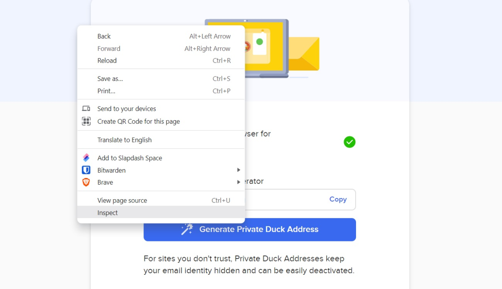
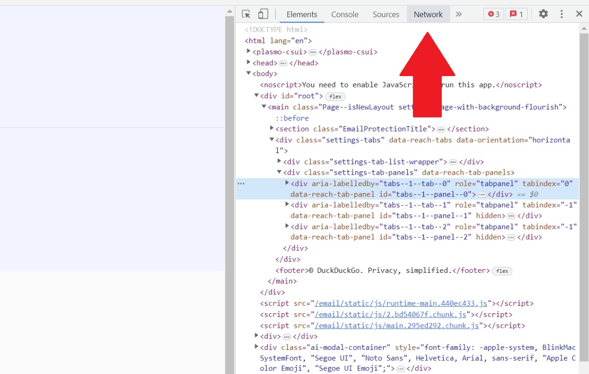
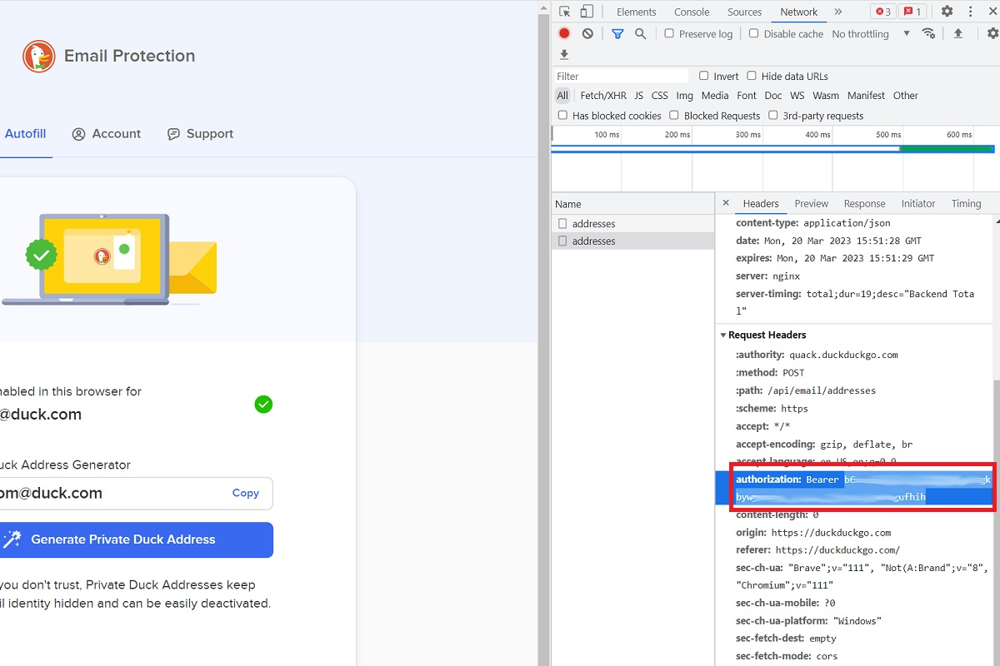

# quackalias-cli - DuckDuckGo Email Alias Generator and History Tracker

This project includes scripts to generate DuckDuckGo email aliases and store the history of generated aliases.

## Configuration

### Obtain the DuckDuckGo API Key

1. [Install the DuckDuckGo web browser extension](https://duckduckgo.com/email/).
2. [Set up the Email Protection feature](https://duckduckgo.com/email/).

From here, follow these steps closely:

- From DuckDuckGo’s email autofill page, right-click anywhere on the page and select “Inspect” from the context menu.

  

- In the developer tools panel, click the “Network” tab at the top.

  

- On the DuckDuckGo site next to the sidebar, click the “Generate Private Duck Address” button.

- In the developer panel sidebar, click on the word “addresses.”

  

- Scroll down until you see the words “authorization: Bearer,” followed by a long string of letters and numbers.

- Copy the long string of letters and numbers (without the “authorization: Bearer” portion) to your clipboard.

> **Note**: You can delete the DuckDuckGo web browser extension after obtaining the API key.

## For Bash 

### Installation

1. **Download the script:**
   Save the script as `ddg.sh` in a directory of your choice.

3. **Set Your DuckDuckGo API Key:**
   Open `ddg.sh` in a text editor and replace the placeholder API key with your actual key:
   ```bash
   API_KEY = "YOUR_API_KEY_HERE"
   ```

2. **Make the script executable:**
   ```bash
   chmod +x ddg.sh
   ```

3. **Move the script to a directory in your `$PATH`:**
   ```bash
   mv ddg.sh /usr/local/bin/ddg
   ```

### Usage

#### Generate an Email Alias

To generate a new DuckDuckGo email alias:
```bash
ddg generate
```

#### View Alias History

To view the history of generated aliases:
```bash
ddg history
```

#### Interactive Menu

To use the interactive menu:
```bash
ddg
```

The script will present the following options:
1. Generate email alias
2. Show aliases history

### History File

The history of generated aliases is stored in `~/.local/share/ddg/aliases_history.txt`. Each entry includes the timestamp and the generated email alias.

## For PowerShell

### Installation

1. **Download the script:**
   Save the script as `ddg.ps1` in a directory of your choice.

2. **Install Required Modules:**
```powershell
# Allow script execution
Set-ExecutionPolicy RemoteSigned -Scope CurrentUser

# Ensure PowerShell can use REST methods
Install-Module -Name PSReadLine -Scope CurrentUser -Force -SkipPublisherCheck
```


2. **Set Execution Policy:**
   Ensure that the PowerShell script execution policy allows running scripts:
   ```powershell
   Set-ExecutionPolicy -Scope CurrentUser -ExecutionPolicy RemoteSigned
   ```

3. **Set Your DuckDuckGo API Key:**
   Open `ddg.ps1` in a text editor and replace the placeholder API key with your actual key:
   ```powershell
   $apiKey = "YOUR_API_KEY_HERE"
   ```

### Usage

#### Generate an Email Alias

To generate a new DuckDuckGo email alias:
```powershell
.\ddg.ps1 -action generate
```

#### View Alias History

To view the history of generated aliases:
```powershell
.\ddg.ps1 -action history
```

#### Interactive Menu

To use the interactive menu:
```powershell
.\ddg.ps1
```

The script will present the following options:
1. Generate email alias
2. Show aliases history

### History File

The history of generated aliases is stored in `C:\Users\YourUsername\.config\ddg\aliases_history.txt`. Each entry includes the timestamp and the generated email alias.

## License

This project is licensed under the MIT License. See the LICENSE file for details.

## Contributing

Contributions are welcome! Please fork this repository and create a pull request with your changes. For major changes, please open an issue first to discuss what you would like to change.
